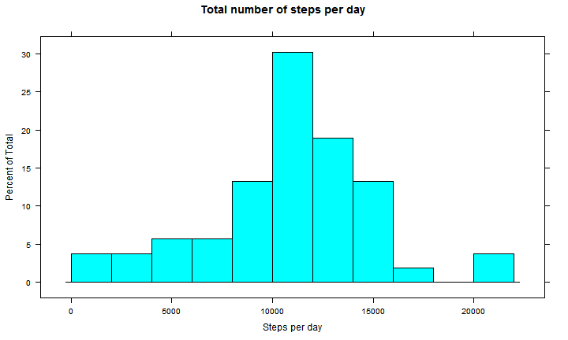
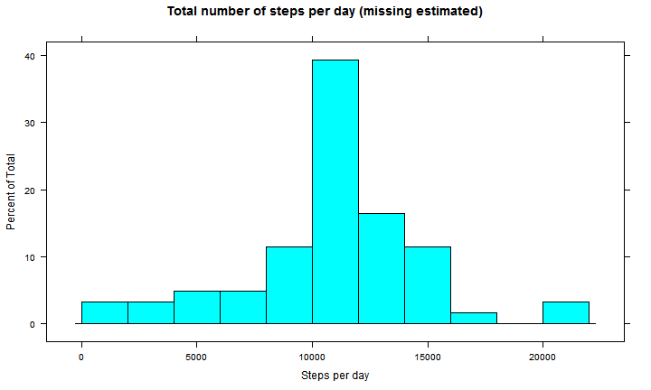
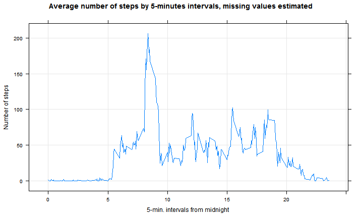
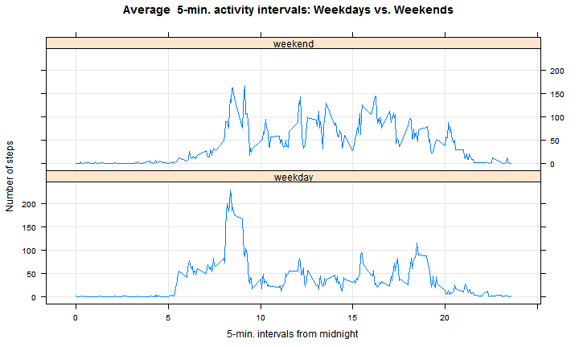
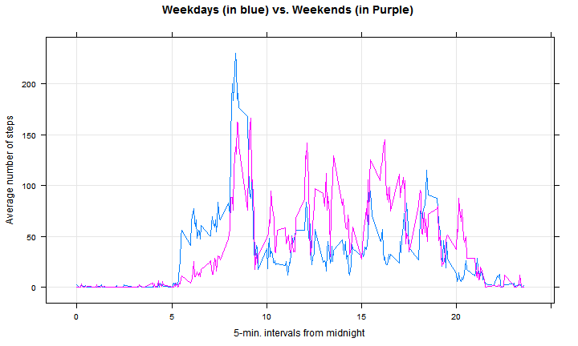

## Reproductible Research
by Roger D. Peng, PhD, Jeff Leek, PhD, Brian Caffo, PhD
Coursera October 2014 session 

### Assignement 1
https://github.com/an763/RepData_PeerAssessment1

## Introduction

We want first ensure, as per instructions, that all statement will be outputed. 

```r
library(knitr)
# set global options
opts_chunk$set(echo=TRUE)
```

We also initalize some common variables:

```r
# cleanup
rm(list=ls())

#libraries
library(lattice)

# for reproductibility
set.seed(590607)

# some usefule variables
dt = Sys.time()
date <- format(dt,"%d-%b-%Y")
time <- format(dt,"%H:%M:%S")

Rversion <- version$version.string
```

This analysis has been performed using R software package for statistical analysis.
The version of R used was R version 3.1.1 (2014-07-10).

This document has been generated on 19-Oct-2014 at 01:30:17.

## Analysis as per assignement

### 1. Loading and preprocessing the data

  1.1 Show any code that is needed to load the data

We download the dataset from the internet and unzip it. Then, we used read.csv to read the file.


```r
# baseDir will be prefixing all data accesses
baseDir <- "."

# create data sub-directory if necessary
dataDir <- file.path(baseDir, "data")
if(!file.exists(dataDir)) { dir.create(dataDir) }

zipFilePath <- file.path(dataDir, "activity.zip")
dateFilePath <- file.path(dataDir, "date_time_downloaded.txt")
# download original data if necessary (skip if exists already as it takes time and bandwith)
if(!file.exists(zipFilePath)) { 
  zipFileUrl <- "https://d396qusza40orc.cloudfront.net/repdata%2Fdata%2Factivity.zip"
  download.file (zipFileUrl, zipFilePath)
  DTDownloaded <- format(Sys.time(), "%Y-%b-%d %H:%M:%S")
  cat (DTDownloaded, file=dateFilePath)
} else {
  DTDownloaded <- scan(file=dateFilePath, what="character", sep="\n")
}

filePath <- file.path(dataDir, "activity.csv")
# unzip file if necessary
if(!file.exists(filePath)) { 
  unzip (zipFilePath, exdir=dataDir)
}

# read dataset and load data in R
dataset <- read.csv(filePath, header = TRUE) 

cat ("The dataset is located at", filePath, "and was downloaded on", DTDownloaded)
```

```
## The dataset is located at ./data/activity.csv and was downloaded on 2014-Oct-19 01:30:18
```

We verify the dataset structure:

```r
str(dataset)
```

```
## 'data.frame':	17568 obs. of  3 variables:
##  $ steps   : int  NA NA NA NA NA NA NA NA NA NA ...
##  $ date    : Factor w/ 61 levels "2012-10-01","2012-10-02",..: 1 1 1 1 1 1 1 1 1 1 ...
##  $ interval: int  0 5 10 15 20 25 30 35 40 45 ...
```

The variables included in this dataset are:

    - steps: Number of steps taking in a 5-minute interval (missing values are coded as NA)
    - date: The date on which the measurement was taken in YYYY-MM-DD format
    - interval: Identifier for the 5-minute interval in which measurement was taken

The dataset is stored in a comma-separated-value (CSV) file and there are a total of ``17568`` observations in this dataset for 17,568 expected from the instructions.

1.2 Process/transform the data (if necessary) into a format suitable for your analysis

a. Let's get dates instead of character strings

```r
dataset$date <- as.Date(dataset$date)
```


b. Intervals are stored as a number in the form of hhmm where hh=hours and mm= minutes. We create 2 variables: time since minight, in minutes, and a string factor instead of the numeric concatenation of hours and minutes.

```r
dataset$minute <- dataset$interval %% 100
dataset$hour <- dataset$interval %/% 100
dataset$elapsed <- dataset$hour * 60 + dataset$minute
# interval as a factor
dataset$sInterval <- as.factor(sprintf("%02d:%02d", dataset$hour, dataset$minute))
```

We also replace the interval ID by hundredths in order to have a better visualisation (hours). 

```r
dataset$interval <- dataset$interval / 100
```

As a pre-processing step, we sum the number of steps for each day, and we average the number of steps for each interval, in order to prepare further analysis. Aggregate with the sum and mean fuction does the trick. 

```r
# create a table with number of steps per day
sumStepsPerDay <- aggregate(steps ~ date, data=dataset, FUN="sum", na.exclude=T)
meanStepsPerInterval <- aggregate(steps ~ sInterval, data=dataset, FUN="mean", na.exclude=T)
#sumStepsPerDay
#meanStepsPerInterval$steps
```


### 2. What is mean total number of steps taken per day?

For this part of the assignment, you can ignore the missing values in the dataset.

  2.1 Make a histogram of the total number of steps taken each day

```r
histogram(sumStepsPerDay$steps, breaks=10, main="Total number of steps per day", xlab="Steps per day")
```

 


  2.2 Calculate and report the mean and median total number of steps taken per day

The mean and median number of steps per days are calculated as follow:

```r
mean(sumStepsPerDay$steps, na.rm=TRUE)
```

```
## [1] 10767.19
```

```r
median(sumStepsPerDay$steps, na.rm=TRUE)
```

```
## [1] 10766
```


### 3. What is the average daily activity pattern?

3.1. Make a time series plot (i.e. type = "l") of the 5-minute interval (x-axis) and the average number of steps taken, averaged across all days (y-axis)

```r
xyplot(steps ~ sInterval, data=meanStepsPerInterval, type="l", grid=TRUE, ylab="Number of steps", xlab="5-min. intervals from midnight", main="Average number of steps by 5-minutes intervals")
```

 


3.2. Which 5-minute interval, on average across all the days in the dataset, contains the maximum number of steps?


```r
intv <- meanStepsPerInterval$sInterval[which.max(meanStepsPerInterval$steps)]
```

The ``08:35`` interval contains the maximum number of steps averaged over all days.


### 4. Imputing missing values

There are a number of days/intervals where there are missing values (coded as NA). The presence of missing days may introduce bias into some calculations or summaries of the data.

4.1. Calculate and report the total number of missing values in the dataset (i.e. the total number of rows with NAs)

```r
misst <- sum(is.na(dataset$steps))
misst
```

```
## [1] 2304
```

```r
sum(is.na(dataset$date))
```

```
## [1] 0
```

```r
sum(is.na(dataset$interval))
```

```
## [1] 0
```
There are ``2304`` missing values for the steps variable but no missing values for date or interval.


4.2. Devise a strategy for filling in all of the missing values in the dataset. The strategy does not need to be sophisticated. For example, you could use the mean/median for that day, or the mean for that 5-minute interval, etc.

We will use the averaged steps per interval (over all days) to replace the missibg value for a given day/interval. These averaged number of steps are available in the dataframe
meanStepsPerInterval as shown below.

```r
str(meanStepsPerInterval)
```

```
## 'data.frame':	288 obs. of  2 variables:
##  $ sInterval: Factor w/ 288 levels "00:00","00:05",..: 1 2 3 4 5 6 7 8 9 10 ...
##  $ steps    : num  1.717 0.3396 0.1321 0.1509 0.0755 ...
```


4.3. Create a new dataset that is equal to the original dataset but with the missing data filled in.

We replace each missing steps value buy the average number of steps calculated for the same interval over all other available dates, and verify it worked.

```r
# replace missig values w
datasetNoMissing <- dataset
for(r in 1:nrow(datasetNoMissing)){
  if (is.na(datasetNoMissing$steps[r])) {
    repl <- meanStepsPerInterval$steps[meanStepsPerInterval$sInterval == datasetNoMissing$sInterval[r]];
    datasetNoMissing$steps[r] <- repl;
  }
}
# we verify it worked
sum(is.na(dataset$steps))
```

```
## [1] 2304
```

```r
sum(is.na(datasetNoMissing$steps))
```

```
## [1] 0
```

```r
str(dataset$steps)
```

```
##  int [1:17568] NA NA NA NA NA NA NA NA NA NA ...
```

```r
str(datasetNoMissing$steps)
```

```
##  num [1:17568] 1.717 0.3396 0.1321 0.1509 0.0755 ...
```


4.4. Make a histogram of the total number of steps taken each day and Calculate and report the mean and median total number of steps taken per day. 

```r
sumStepsPerDayNoMissing <- aggregate(steps ~ date, data=datasetNoMissing, sum)
histogram(sumStepsPerDayNoMissing$steps, breaks=10, main="Total number of steps per day (missing estimated)", xlab="Steps per day")
```

 

```r
mean(sumStepsPerDayNoMissing$steps, na.rm=TRUE)
```

```
## [1] 10766.19
```

```r
median(sumStepsPerDayNoMissing$steps, na.rm=TRUE)
```

```
## [1] 10766.19
```

Do these values differ from the estimates from the first part of the assignment? 

**Estimating the missing values doesn't change the shape of the histogram. The median and the mean aren't much changed either.**

What is the impact of imputing missing data on the estimates of the total daily number of steps?

**The total daily number of steps increases as a result of added values, specially around the mean.**


4.5. Make a time series plot (i.e. type = "l") of the 5-minute interval (x-axis) and the average number of steps taken, averaged across all days (y-axis)

```r
meanStepsPerIntervalNoMissing <- aggregate(steps ~ interval, data=dataset, FUN="mean", na.exclude=T)
xyplot(meanStepsPerIntervalNoMissing$steps ~ meanStepsPerIntervalNoMissing$interval,type="l", grid=T, ylab="Number of steps", xlab="5-min. intervals from midnight", main="Average number of steps by 5-minutes intervals, missing values estimated")
```

 


### 5. Are there differences in activity patterns between weekdays and weekends?

For this part the "weekdays()" function may be of some help here. Use the dataset with the filled-in missing values for this part.

5.1. Create a new factor variable in the dataset with two levels -- "weekday" and "weekend" indicating whether a given date is a weekday or weekend day.

```r
datasetNoMissing$day <- "weekday"
datasetNoMissing$day[weekdays(as.Date(datasetNoMissing$date), abb=T) %in% c("Sat","Sun")] <- "weekend"
```
datasetNoMissing$day contains "weekday" or "weekend".

```r
table(datasetNoMissing$day)
```

```
## 
## weekday weekend 
##   12960    4608
```


5.2. Make a panel plot containing a time series plot (i.e. type = "l") of the 5-minute interval (x-axis) and the average number of steps taken, averaged across all weekday days or weekend days (y-axis).

First, let's produce the graph as per assgnement exemple (2 superposedpanesl):

```r
meanStepsPerIntervalNoMissingDay <- aggregate(steps ~ interval + day, data=datasetNoMissing, FUN="mean")
xyplot(steps ~ interval | day, data=meanStepsPerIntervalNoMissingDay, type="l", grid=T, layout=c(1,2), ylab="Number of steps", xlab="5-min. intervals from midnight", main="Average  5-min. activity intervals: Weekdays vs. Weekends")
```

 

We can visualy observe that the number of steps are high for all intervals during weekend days, whereas they are concentrated in the morning hours for weekdays.

Another representation would be supperposing both factors on the same graph:

```r
xyplot(steps ~ interval, data=meanStepsPerIntervalNoMissingDay, groups=meanStepsPerIntervalNoMissingDay$day, type="l", grid=T, ylab="Average number of steps", xlab="5-min. intervals from midnight", main="Weekdays (in blue) vs. Weekends (in Purple)")
```

 

## References

1. R Core Team. R: A language and environment for statistical computing. URL: http://www.R-project.org. R Foundation for Statistical Computing, 2013.

2. R Markdown Page. URL: http://www.rstudio.com/ide/docs/authoring/using_markdown. 

3. Lattice: Multivariate Data Visualization with R available via SpringerLink by Deepayan Sarkar, Springer, 2008.
